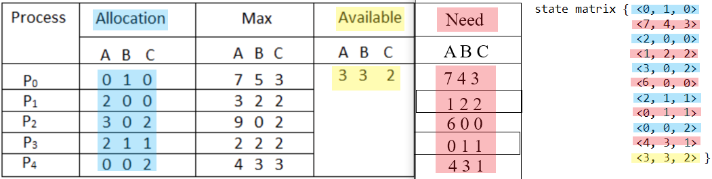

# Bankers-Algorithm
## Overview
This implementation is written in C++ and involves a process that takes in a text file with the state of a system and determines the safe sequence using the Banker's Algorithm. This algorithm calls for matrices for *allocation*, *max*, and *need*, and a vector for *available*. However, this program parses a given text file and stores the data into a single matrix.

If the given input is in the correct format, this matrix is divided in a way such that every even index, including zero, represents a row (a vector) in the *allocation* matrix; and every odd index represents a row in the *need* matrix. The *need* matrix is found by subtracting the values in the *allocation* matrix from the values in the *max* matrix. Finally, the *available* vector is appended to the matrix as the last element. The parsing is color coded below:

  

## Features
- Enter any txt file in the correct format (shown in the image below) in the same directory, and the result will either be the safe sequence or an error stating that the state of the system is unsafe.
  - Vectors in *allocation* and *max* must be in parenthesis.
  - The *available* vector must be in curly brackets.

  
   | 

## Requirements
Any environment that can compile C++ code should be sufficient.

## Usage
In the working directory, enter  
`$ g++ main.cpp banker.cpp -o a.out`  
`$ ./a.out`  

Then enter a txt file including the file name extension.

  

